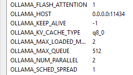

# LangGraph Tool Code Generator & Interpreter

> **Autonomous code generation pipeline** using LangGraph orchestration and multi-model LLM approach

A reusable LangGraph workflow that automatically generates, validates, and executes Python data analysis tools from natural language queries. Designed as a composable subgraph for integration into larger agent systems. Built with LangGraph state machine orchestration and powered by specialized LLMs for reasoning and code generation.

---

## Overview

**What it does:**
1. Takes a natural language data analysis query
2. Extracts structured intent using reasoning model (DeepSeek-R1)
3. Generates formal tool specifications
4. Generates Python code using specialized coding model (Qwen 2.5-Coder)
5. Validates code in isolated Docker/subprocess sandbox
6. Executes and captures analysis results
7. Promotes validated tools to active registry
8. Packages all outputs into `projected_*` fields for seamless parent-graph integration

**Use as a Child Graph:**
This pipeline is designed to be integrated into larger agent systems as a reusable LangGraph subgraph. Use `build_graph()` to get the compiled graph and integrate it into your parent workflow.

**Example Query:**
```
"Run ANOVA across groups, then perform Tukey HSD post-hoc test with p-values and effect sizes"
```

**Result:**
- Generated tool: `anova_tukeyhsd_traffic_injuries_<timestamp>.py`
- Statistical analysis with validated output
- Automatically added to active tool registry (`tools/active/`)

---

## Architecture

### Tech Stack
- **LangGraph** - StateGraph workflow orchestration and composability
- **DeepSeek-R1 70B** - Reasoning model for intent extraction and spec generation
- **Qwen 2.5-Coder 32B** - Code generation and repair
- **Ollama** - Local LLM inference server
- **Pydantic v2.5+** - Data validation
- **Python 3.10+** - Core runtime
- **Docker** - Sandbox isolation (optional subprocess mode available)

### Pipeline Flow

```
User Query 
    ↓
Intent Extraction (DeepSeek-R1)
    ↓
Spec Generation (DeepSeek-R1)
    ↓
Code Generation (Qwen 2.5-Coder)
    ↓
Validation (syntax + schema + sandbox)
    ├─→ PASS → Executor
    └─→ FAIL → Repair (Qwen 2.5-Coder, max 5 attempts)
              ↓
         Validator
    ↓
Executor (run on actual data)
    ├─→ SUCCESS → Promoter
    └─→ FAIL → END (with error report)
    ↓
Promoter (save to active registry)
    ↓
Projection (package outputs into projected_* fields for parent graph)
    ↓
END
```

### LangGraph Nodes

The pipeline consists of the following nodes:

- **intent_node** - Extracts structured intent from natural language using reasoning model
- **spec_generator_node** - Creates formal tool specification with I/O schemas
- **code_generator_node** - Generates Python code implementing the specification
- **validator_node** - Validates syntax, schema compliance, and sandbox execution
- **repair_node** - Repairs code based on validation errors (max 5 attempts)
- **executor_node** - Executes the tool on actual user data
- **promoter_node** - Promotes successful tool to active registry
- **projection_node** - Terminal node; packages all child outputs into `projected_*` fields compatible with the parent graph (`AnalysisPipelineState`)

For detailed architecture and module descriptions, see [module_prs/README.md](module_prs/README.md)

---

## Project Structure

```
MCP_Tool_Code_Interpreter_Generator/
├── src/                         # Core modules
│   ├── models.py               # Pydantic models and LangGraph state
│   ├── llm_client.py           # Multi-model LLM client
│   ├── intent_extraction.py    # Intent extraction node
│   ├── intent_validator.py     # Intent validation logic
│   ├── spec_generator.py       # Specification generation node
│   ├── code_generator.py       # Code generation + repair nodes
│   ├── validator.py            # Validation node  
│   ├── executor.py             # Execution node
│   ├── promoter.py             # Registry promotion node
│   ├── sandbox.py              # Sandboxed code execution
│   ├── pipeline.py             # LangGraph orchestrator & graph builder
│   └── logger_config.py        # Logging configuration
│
├── tools/                       # Generated tools
│   ├── draft/                  # Initial generated code
│   ├── active/                 # Promoted, production-ready tools
│   ├── sandbox/                # Sandbox workspace for execution
│   └── registry.json          # Active tool metadata (written by promoter)
│
├── output/                      # Execution results
│   ├── active/                 # Successful execution outputs (JSON)
│   ├── draft/                  # Failed/debug outputs
│   └── plots/                  # Generated visualisation PNGs
│
├── config/                      # Configuration files
│   ├── config.yaml             # Main configuration
│   ├── sandbox_policy.yaml     # Sandbox security policy
│   └── prompts/                # LLM prompt templates
│       ├── intent_extraction_v2.txt
│       ├── spec_generation.txt
│       ├── code_generation.txt
│       └── code_repair.txt
│
├── docker/                      # Docker sandbox
│   ├── Dockerfile.sandbox
│   └── docker-compose.sandbox.yml
│
├── integration/                 # Parent-graph integration adapter
│   ├── __init__.py             # Exports build_child_input, apply_child_output
│   └── mapper.py               # Input mapper + output projector implementation
│
├── tests/                       # Test suite
├── docs/                        # Documentation
└── test.py                      # Interactive pipeline testing
```

---

## Quick Start

### 1. Prerequisites

- Python 3.10 or higher
- [Ollama](https://ollama.ai/) installed and running
- Docker (optional, for Docker sandbox mode)

### 2. Setup Ollama Models

```bash
# Pull the reasoning model (for intent extraction & spec generation)
ollama pull deepseek-r1:70b

# Pull the coding model (for code generation & repair)
ollama pull qwen2.5-coder:32b

# Verify models are available
ollama list
```

### 3. Setup Environment

```bash
# Clone the repository (if applicable)
cd MCP_Tool_Code_Interpreter_Generator

# Create virtual environment
python -m venv venv

# Activate virtual environment
# On Windows:
venv\Scripts\activate
# On macOS/Linux:
source venv/bin/activate

# Install dependencies
pip install -r requirements.txt
pip install -r requirements-dev.txt
```

### 4. Configure the System

The default configuration in `config/config.yaml` should work with Ollama:

```yaml
llm:
  base_url: "http://localhost:11434/v1"  # Ollama default endpoint
  
  models:
    reasoning: "deepseek-r1:70b"         # Intent + spec generation
    coding: "qwen2.5-coder:32b"          # Code generation + repair
    
  
  temperature: 0.0

sandbox:
  mode: "docker"  # or "subprocess" for faster testing
  timeout_seconds: 120
  memory_limit_mb: 512
```

### 5. Test the Pipeline

```bash
# Run interactive test with a sample query
python test.py "Calculate average values by group"

# Run with specific query
python test.py "Run ANOVA across groups with Tukey HSD post-hoc test"

# Adjust verbosity
python test.py -v "your query here"
python test.py -d "your query here"
```

---

## Multi-Model Configuration

The system uses **two specialized models** for optimal performance:

### Reasoning Model (DeepSeek-R1 70B)
- **Used for:** Intent extraction, spec generation
- **Why:** Better at understanding complex requirements and planning
- **Behavior:** May include `<think>` tags in reasoning process (automatically stripped)

### Coding Model (Qwen 2.5-Coder 32B)
- **Used for:** Code generation, code repair
- **Why:** Specialized for generating clean, efficient Python code
- **Behavior:** Focused output without meta-commentary

### LLM Client Internals ([src/llm_client.py](src/llm_client.py))

- `model_override` parameter on `QwenLLMClient.__init__` selects model by alias (`"reasoning"` or `"coding"`)
- Temperature fixed at `0.0` for deterministic structured output
- `<think>` tag stripping: all content between `<think>...</think>` is removed before JSON parsing
- Smart brace boundary detection: finds the outermost `{...}` block in the response to handle wrapped or padded output
- Markdown code fence extraction: strips triple-backtick blocks before JSON parsing

### Prompt Design ([config/prompts/](config/prompts/))

Strict JSON enforcement instructions sent with every reasoning-model call:

```
CRITICAL INSTRUCTIONS:
- Return ONLY valid JSON conforming to the schema below
- DO NOT include any explanatory text, thinking process, or commentary
- DO NOT use <think> tags or similar meta-text
- DO NOT add markdown code fences around the JSON
- Output must be pure JSON starting with { and ending with }
```

Operation selection guide embedded in the intent extraction prompt:

```
OPERATION SELECTION GUIDE:
- "top N X by Y" or "most common X"  -> use "groupby_aggregate"
- "filter by X"                      -> use "filter"
- "summary statistics"               -> use "describe_summary"
- "ANOVA / statistical test"         -> use "statistical_test"
```

---

## Integration & Usage

### Standalone Testing

For development and testing, use the interactive test script:

```bash
# Test with a specific query
python test.py "your analysis query"

# Adjust verbosity
python test.py -d "query here"
```

---

### Integrating with a Parent LangGraph (`AnalysisPipelineState`)

The child graph (`ToolGeneratorState`) is designed to be called as a **black-box node**
from a parent graph (`AnalysisPipelineState`). Because the parent uses `extra='forbid'`,
the child schema was adapted so **no parent schema changes are required**.

#### State compatibility

| Concern | How it is resolved |
|---|---|
| Parent `extra='forbid'` | Child outputs are projected into existing parent channels only |
| `messages` type mismatch | Child `messages` migrated to `List[BaseMessage]` + `add_messages`, matching parent exactly |
| Child-internal fields (`tool_spec`, `generated_code`, etc.) | Never written to parent; stay inside child state |
| All child results | Packaged by `projection_node` (terminal child node) into 6 `projected_*` fields |

#### Output projection map

After `child_graph.invoke()` completes, `projection_node` has pre-packaged
all results into these fields on the returned child state:

| Child field | Parent channel | Type |
|---|---|---|
| `projected_tool_transcript` | `tool_transcript` | `List[Dict[str, Any]]` |
| `projected_artifact_log` | `artifact_log` | `List[str]` (active tool py, active output JSON, plot PNG if generated) |
| `projected_capability_gap` | `capability_gap` | `Optional[Dict[str, Any]]` |
| `projected_errors` | `errors` | `List[str]` |
| `projected_warnings` | `warnings` | `List[str]` |
| `projected_final_artifacts` | `final_artifacts` | `Dict[str, Any]` |

#### Integration adapter (`integration/`)

The `integration/` package at the project root provides two functions that
implement the full integration contract. **The parent-graph owner only needs these two calls.**

```
integration/
├── __init__.py   # exports build_child_input, apply_child_output
└── mapper.py     # full implementation with docstrings
```

##### Step 1 — Import

```python
import sys
sys.path.insert(0, "/path/to/MCP_Tool_Code_Interpreter_Generator")

from integration import build_child_input, apply_child_output
from src.pipeline import build_graph
```

##### Step 2 — Build the child graph once (outside your node)

```python
child_graph = build_graph()
```

##### Step 3 — Call the child graph from a parent node

```python
def tool_generator_node(parent_state: AnalysisPipelineState) -> dict:
    """Parent graph node that runs the child tool-generator pipeline."""

    # Build a valid initial ToolGeneratorState from parent fields:
    #   instruction  -> user_query
    #   dataset_path -> data_path
    child_init = build_child_input(parent_state)

    # Run the child graph (projection_node runs last, populates projected_* fields)
    config = {"configurable": {"thread_id": "toolgen-1"}}
    child_result = child_graph.invoke(child_init, config)

    # Write child projected_* fields into parent-safe channels (in-place):
    #   projected_tool_transcript -> tool_transcript  (list extend, deduped)
    #   projected_artifact_log    -> artifact_log     (list extend, deduped)
    #   projected_capability_gap  -> capability_gap   (replace)
    #   projected_errors          -> errors           (list extend)
    #   projected_warnings        -> warnings         (list extend)
    #   projected_final_artifacts -> final_artifacts  (dict.update)
    apply_child_output(child_result, parent_state)

    # Return any additional parent-level fields you want to update
    return {}
```

##### Step 4 — Wire the node into the parent graph

```python
from langgraph.graph import StateGraph, END

parent = StateGraph(AnalysisPipelineState)
parent.add_node("tool_generator_node", tool_generator_node)
parent.add_edge("planner", "tool_generator_node")
parent.add_edge("tool_generator_node", "reviewer")
parent_graph = parent.compile()
```

##### Complete minimal example

```python
from integration import build_child_input, apply_child_output
from src.pipeline import build_graph
from langgraph.graph import StateGraph, END

child_graph = build_graph()

def tool_generator_node(state):
    child_result = child_graph.invoke(
        build_child_input(state),
        {"configurable": {"thread_id": "toolgen-1"}}
    )
    apply_child_output(child_result, state)
    return {}

parent = StateGraph(AnalysisPipelineState)
parent.add_node("tool_generator_node", tool_generator_node)
# ... add remaining nodes and edges
parent_graph = parent.compile()
```

#### What `capability_gap` means in the parent

`capability_gap` being non-`None` after the child runs means the gap detector
found no existing tool with ≥ 50% overlap score and triggered generation of a new one.
This is the **normal success path**, not an error. Interpret it as:
> "A new tool was generated to fill this capability gap."

> **Note:** The gap detector only considers tools whose active file exists on disk (`tools/active/`). Stale registry entries pointing to deleted files are automatically excluded.

The promoted tool metadata is available in `final_artifacts["promoted_tool"]`.

> **Note:** For agent integration, `server.py` is not needed. Use `build_graph()` or `run_pipeline()` directly from `src/pipeline.py`.

---

## Tool Lifecycle

```
DRAFT → Validation → Execution → PROMOTED
  ↓          ↓            ↓
  └─ (repair loop) ─────────→ REJECTED
```

### Tool States

Tools are stored in different directories based on their status:

- **DRAFT** (`tools/draft/`) - Freshly generated code, may have errors
- **ACTIVE** (`tools/active/`) - Validated and executed successfully, production-ready
- **Outputs** (`output/active/`) - Execution results from successful tool runs as JSON
- **Plots** (`output/plots/`) - Visualisation PNGs generated by visual queries
- **Registry** (`tools/registry.json`) - Metadata for all promoted tools

### Output Organization

Generated outputs follow the naming pattern:
```
<operation>_<dataset>_<timestamp>_output.json
```

Example:
```
output/active/anova_tukeyhsd_traffic_injuries_20260210_171102_output.json
```

Each output includes:
- Original query and parameters
- Generated code
- Execution results
- Validation report
- Timestamps and metadata

---

## Testing

```bash
# Run all tests
pytest tests/

# Run specific module tests
pytest tests/test_intent_extraction.py -v
pytest tests/test_validator.py -v

# Run with coverage
pytest --cov=src tests/

# Integration tests
pytest tests/test_integration.py

# Interactive pipeline test
python test.py "your analysis query"
```

### Test Verbosity Levels

```bash
# Quiet - minimal output
python test.py -q "query"

# Normal - standard progress (default)
python test.py "query"

# Verbose - detailed step information
python test.py -v "query"

# Debug - full LLM prompts and responses
python test.py -d "query"
```

---

## Security

### Sandbox Isolation

All generated code runs in an isolated sandbox with:

- **No network access** - Prevents data exfiltration
- **Restricted file system** - Read-only access to data files only
- **Resource limits** - CPU, memory, and timeout constraints
- **Import restrictions** - Only allowlisted libraries permitted
- **Subprocess restrictions** - No shell commands or external processes

### Sandbox Modes

**1. Docker Mode (Recommended for Production)**
```yaml
sandbox:
  mode: "docker"
  timeout_seconds: 120
  memory_limit_mb: 512
```

- Full container isolation
- Complete environment control  
- Higher security guarantees
- Slower startup time

**2. Subprocess Mode (Development)**
```yaml
sandbox:
  mode: "subprocess"
  timeout_seconds: 30
  memory_limit_mb: 512
```

- Faster execution
- Shared host environment
- Lower isolation guarantees
- Good for rapid iteration

### Security Policy

Configure allowed/blocked imports in `config/sandbox_policy.yaml`:

```yaml
allowed_libraries:
  - pandas
  - numpy
  - scipy
  - statsmodels
  - matplotlib
  - seaborn

blocked_imports:
  - os
  - subprocess
  - sys
  - requests
  - urllib
```

See [docs/SANDBOX_SECURITY.md](docs/SANDBOX_SECURITY.md) for comprehensive security documentation.

---

## Configuration

### Main Config: `config/config.yaml`

```yaml
# LLM Configuration
llm:
  base_url: "http://localhost:11434/v1"
  
  models:
    reasoning: "deepseek-r1:70b"    # Intent extraction & spec generation
    coding: "qwen2.5-coder:32b"     # Code generation & repair
    
  temperature: 0.0

# Directory paths
paths:
  draft_dir: "./tools/draft"
  staged_dir: "./tools/staged"
  active_dir: "./tools/active"
  registry: "./tools/registry.json"
  sandbox_workspace: "./tools/sandbox"

# Validation settings
validation:
  max_repair_attempts: 5            # Code repair retry limit
  sandbox_timeout_seconds: 120

# Sandbox configuration
sandbox:
  mode: "docker"                    # "docker" or "subprocess"
  timeout_seconds: 120              # Execution timeout
  memory_limit_mb: 512              # Memory limit

# Logging
logging:
  level: "INFO"                     # DEBUG, INFO, WARNING, ERROR
  file: "./logs/pipeline.log"
```

### Prompt Templates: `config/prompts/`

- `intent_extraction_v2.txt` - Extract structured intent from queries
- `spec_generation.txt` - Generate tool specifications
- `code_generation.txt` - Generate Python implementation code
- `code_repair.txt` - Repair code based on validation errors

### Sandbox Policy: `config/sandbox_policy.yaml`

Controls security restrictions for code execution:
- Allowed/blocked Python imports
- Resource limits (CPU, memory, timeout)
- Filesystem access restrictions
- Network policies

---

## Implementation Status

### Completed Features

- Multi-model LLM integration (DeepSeek-R1 + Qwen 2.5-Coder)
- LangGraph pipeline orchestration
- Intent extraction with structured output
- Specification generation with I/O schemas
- Code generation with FastMCP decorators
- Multi-stage validation (syntax, schema, sandbox)
- Automated code repair (up to 3 attempts)
- Sandboxed execution (Docker + subprocess modes)
- Tool registry and promotion system
- Comprehensive logging and debugging
- Statistical analysis support (ANOVA, Tukey HSD, etc.)
- Graph visualization (Mermaid diagrams + auto-saved PNG)
- `projection_node` — terminal node packaging all outputs into `projected_*` fields
- `ToolGeneratorState` schema updated for parent-graph compatibility (`messages`, `errors`, 6 `projected_*` fields)
- Parent-graph integration adapter (`integration/` — `build_child_input`, `apply_child_output`)
- Automatic plot generation for visual queries (trend, chart, distribution keywords) — saved to `output/plots/`
- Groupby fallback: ambiguous "by group" queries auto-select a categorical column with a clarification note
- Gap detector filters stale registry entries (tools whose active file has been deleted are excluded)

### Active Development

- Enhanced error recovery strategies
- Additional statistical operations
- Performance optimizations
- Extended test coverage

**For detailed implementation specs, see [module_prs/README.md](module_prs/README.md)**

---

## Development

### Setup Dev Environment

```bash
# Install dev dependencies
pip install -r requirements-dev.txt

# Run linter
ruff check src/

# Format code
black src/ tests/

# Type checking
mypy src/
```

### Utility Scripts

```bash
# Clean sandbox temporary files
python scripts/clean_sandbox.py

# Generate graph visualization
python visualize_graph.py
```

### Graph Visualization

The pipeline automatically generates a Mermaid diagram (`pipeline_graph.mmd`) showing the LangGraph workflow. View it at [mermaid.live](https://mermaid.live).

---

## Ollama Server Configuration

Set these environment variables on the **GPU machine** before starting `ollama serve` to maximise performance on multi-GPU setups.




```powershell
# Windows — set persistently for the current user (no admin rights required)
[System.Environment]::SetEnvironmentVariable("OLLAMA_HOST",             "0.0.0.0:11434", "User")
[System.Environment]::SetEnvironmentVariable("OLLAMA_FLASH_ATTENTION",  "1",             "User")
[System.Environment]::SetEnvironmentVariable("OLLAMA_KEEP_ALIVE",       "-1",            "User")
[System.Environment]::SetEnvironmentVariable("OLLAMA_KV_CACHE_TYPE",    "q8_0",          "User")
[System.Environment]::SetEnvironmentVariable("OLLAMA_MAX_LOADED_MODELS","2",             "User")
[System.Environment]::SetEnvironmentVariable("OLLAMA_MAX_QUEUE",        "512",           "User")
[System.Environment]::SetEnvironmentVariable("OLLAMA_NUM_PARALLEL",     "2",             "User")
[System.Environment]::SetEnvironmentVariable("OLLAMA_SCHED_SPREAD",     "1",             "User")
```

```bash
# Linux / macOS — add to ~/.bashrc or ~/.zshrc
export OLLAMA_HOST=0.0.0.0:11434
export OLLAMA_FLASH_ATTENTION=1
export OLLAMA_KEEP_ALIVE=-1
export OLLAMA_KV_CACHE_TYPE=q8_0
export OLLAMA_MAX_LOADED_MODELS=2
export OLLAMA_MAX_QUEUE=512
export OLLAMA_NUM_PARALLEL=2
export OLLAMA_SCHED_SPREAD=1
```

### Variable Reference

| Variable | Value | Purpose |
|---|---|---|
| `OLLAMA_HOST` | `0.0.0.0:11434` | Bind on all interfaces so client machines can reach Ollama over the network |
| `OLLAMA_FLASH_ATTENTION` | `1` | Enable Flash Attention — reduces memory usage and speeds up attention computation |
| `OLLAMA_KEEP_ALIVE` | `-1` | Keep models loaded in VRAM indefinitely (no auto-unload after idle timeout) |
| `OLLAMA_KV_CACHE_TYPE` | `q8_0` | Quantise the KV cache to 8-bit — cuts KV cache VRAM from ~40 GB to ~5 GB |
| `OLLAMA_MAX_LOADED_MODELS` | `2` | Allow both `deepseek-r1:70b` and `qwen2.5-coder:32b` to stay loaded simultaneously |
| `OLLAMA_MAX_QUEUE` | `512` | Maximum number of requests that can queue before Ollama returns 503 |
| `OLLAMA_NUM_PARALLEL` | `2` | Number of parallel inference requests per model (matches `max_concurrent_pipelines`) |
| `OLLAMA_SCHED_SPREAD` | `1` | Spread model layers evenly across all available GPUs (important for 2× A6000 setups) |

> **After setting these variables, restart Ollama:**
> ```powershell
> Get-Process | Where-Object { $_.Name -like "*ollama*" } | Stop-Process -Force
> Start-Sleep -Seconds 3
> ollama serve
> ```
> Verify the server is listening on all interfaces:
> ```powershell
> netstat -an | findstr 11434
> # Must show: 0.0.0.0:11434
> ```

---

## Troubleshooting

### Common Issues

**1. Ollama Connection Failed**

```bash
# Check if Ollama is running
ollama list

# Check API endpoint
curl http://localhost:11434/v1/models

# Restart Ollama if needed
# (OS-specific restart command)
```

**2. Models Not Found**

```bash
# Pull required models
ollama pull deepseek-r1:70b
ollama pull qwen2.5-coder:32b

# Verify models are available
ollama list
```

**3. Validation Failures**

- Review `ValidationReport.errors` in output
- Check generated code in `tools/draft/`
- Examine validation details in logs
- Review sandbox execution logs

**4. Docker Sandbox Issues**

```bash
# Check Docker is running
docker ps

# Build sandbox image
cd docker
docker-compose -f docker-compose.sandbox.yml build

# Check sandbox logs
docker logs <container_id>
```

**5. Import Errors in Sandbox**

- Verify library is listed in `config/sandbox_policy.yaml`
- Check library is installed in sandbox environment
- For Docker mode: rebuild sandbox image after adding libraries

**6. Memory/Timeout Errors**

Adjust limits in `config/config.yaml`:
```yaml
sandbox:
  timeout_seconds: 120      # Increase timeout
  memory_limit_mb: 1024     # Increase memory
```

### Debug Mode

Enable detailed logging to troubleshoot issues:

```bash
# Set debug verbosity
python test.py -d "query"
```

Or configure in code:
```python
import logging
logging.basicConfig(level=logging.DEBUG)
```

Check logs in `logs/pipeline.log` for detailed execution traces.

### Output Inspection

```bash
# Check draft tools
ls -la tools/draft/

# Check active tools
ls -la tools/active/

# Check execution outputs
ls -la output/active/

# View specific output
cat output/active/anova_tukeyhsd_traffic_injuries_<timestamp>_output.json
```

---

## Documentation

### For Users
- **[Quick Start](#-quick-start)** - Get up and running
- **[Configuration](#-configuration)** - System configuration
- **[Testing](#-testing)** - Run tests and validate
- **[Troubleshooting](#-troubleshooting)** - Common issues and solutions

### For Developers
- **[Module PRs](module_prs/README.md)** - Complete implementation specs
- **[Sandbox Security](docs/SANDBOX_SECURITY.md)** - Security policies and implementation
- **[Logging](docs/LOGGING.md)** - Logging configuration and usage
- **[Architecture Docs](docs/)** - Design decisions and diagrams

---
## Open Source tools - acknowledgement

- **LangGraph** - Workflow orchestration and graph composition
- **Ollama** - Local LLM inference
- **DeepSeek** - Reasoning model
- **Qwen** - Code generation model

---


 
**Last Updated**: February 25, 2026

For detailed module documentation and implementation specs, see [module_prs/README.md](module_prs/README.md).
